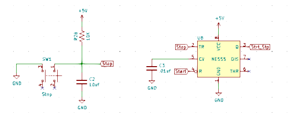
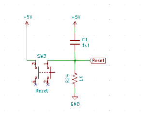
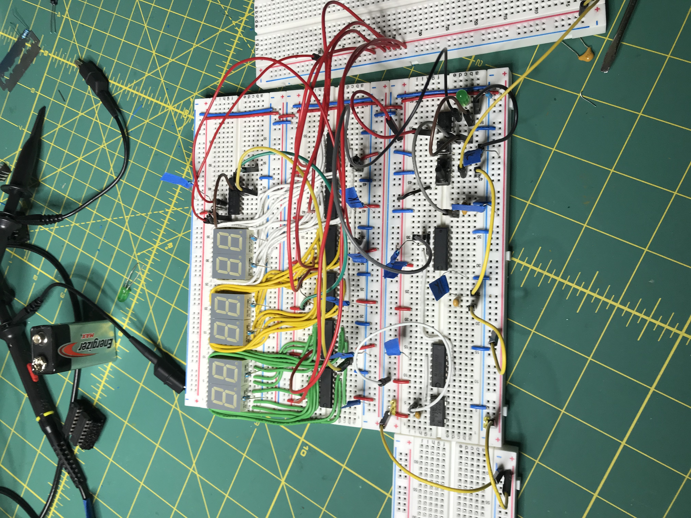
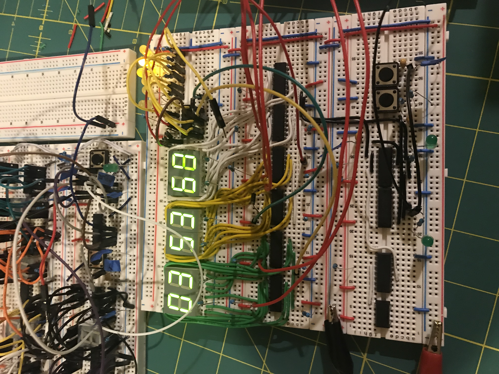
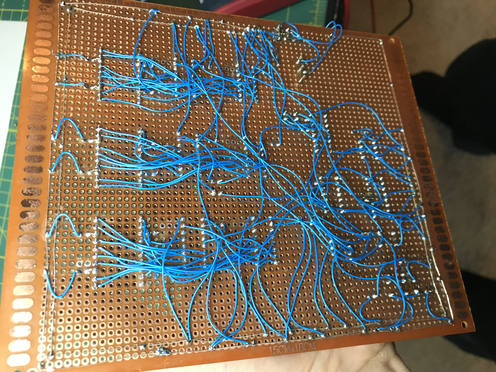
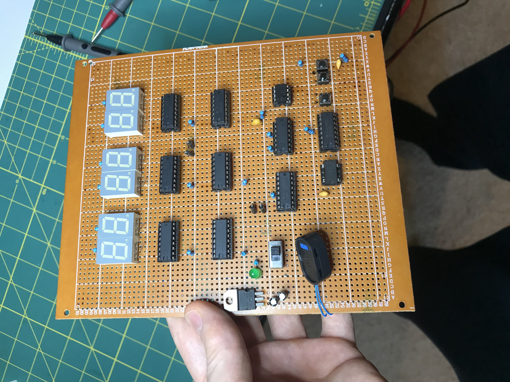
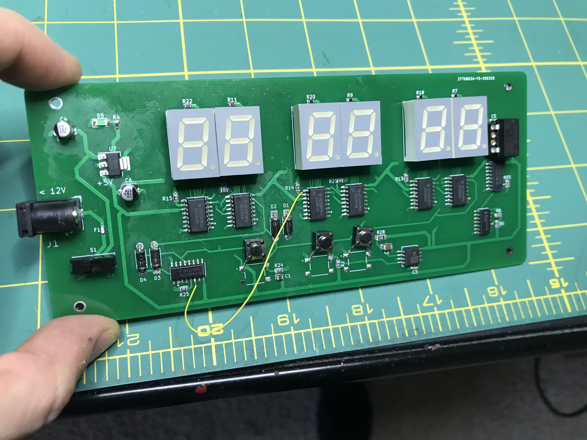
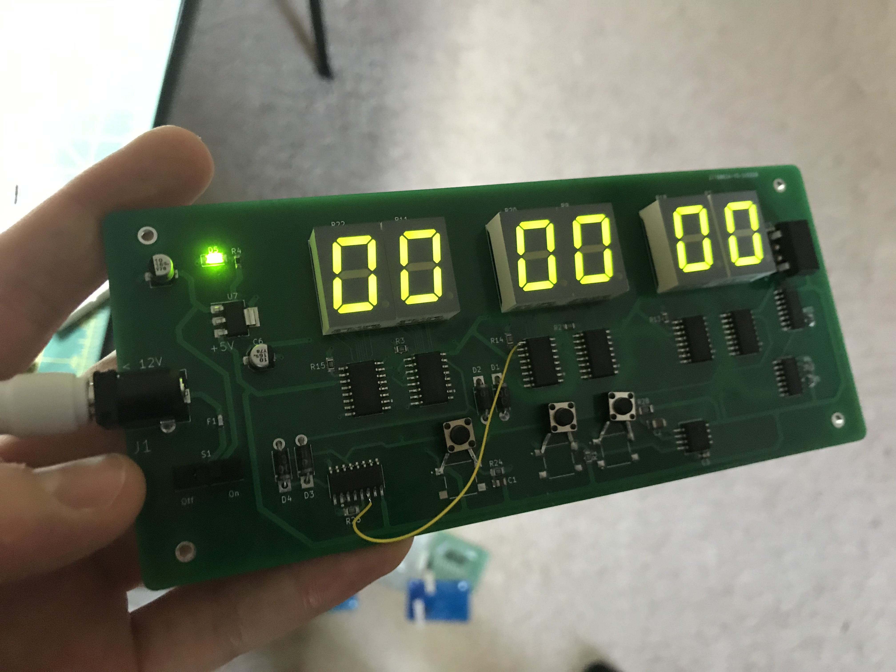

# Counter/Stopwatch

This stopwatch was inspired by [this](http://www.hackersbench.com/Projects/1Hz/) and [this](https://www.gadgetronicx.com/diy-stopwatch-digital-ic-4026-4017/)
article which discuss frequency division and 7-segment counting. 

The premise for this circuit was to create a handheld stopwatch out of discrete ICs with no microcontroller, 
but since 7-segment displays are so power hungry and show poorly in daylight,
it ended up being powered through a barrel jack and a 9-12v dc supply. 

The 7-segment displays are all driven by 4026 chips, which are BCD counters and decoders with a carry, reset, and clock inhibit feature.
The clock source is an EPSON SG531P divided down to 100HZ through a 4060 chip and an SN74LS74 (the SN74LS74 chip is there because
the 4060 chip only divides it down to 200HZ).

To ensure the display comes on in a paused and reset state, an RC timing circuit is used to initially latch a logic high 
on the output of the 555 timer, which in turn drives the clock inhibit pin on the first 7-segment display, dominoeing to each display 
and preventing them from counting.

Similarly, the displacement charge of a high-pass filter is used to quickly pulse a logic high on the reset pin of
every 4026 chip, ensuring 0s on each display at startup.

Each 4026 chip feeds its carry-out pin to the next chip's clock for counting. To achieve a carry-out at 60 seconds, the 4017's 6th binary
count pin is hooked up to itself, the reset line of the 60-second counting unit, and the clock of the first minute driver chip.

# Prototypes
1. Stage 1 breadboard prototypes, which initially combined the start/stop functionality into one button before separating
them into two due to the unreliability of debouncing even with schmitt triggers and capacitors.

2. Stage 2 perfboard prototype. Initially using a 9v battery. Merely looking at the wiring in the back will turn you into an Italian.

3. Stage 3 prototype on a 2 layer PCB using the barrel jack. 
I oriented the buttons wrong and embarassingly missed a trace, but once I fit a wire on the board, it worked.

