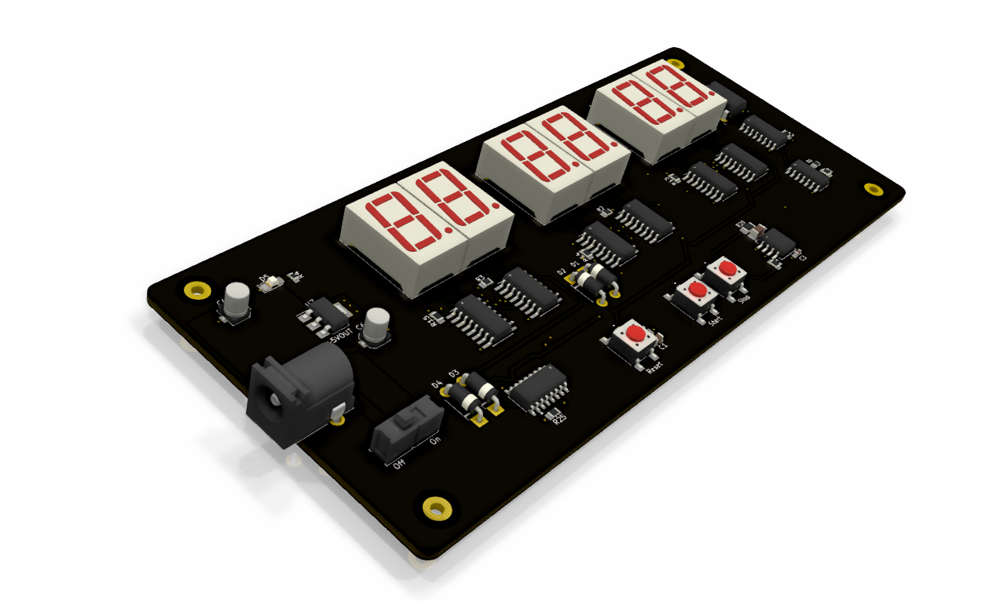
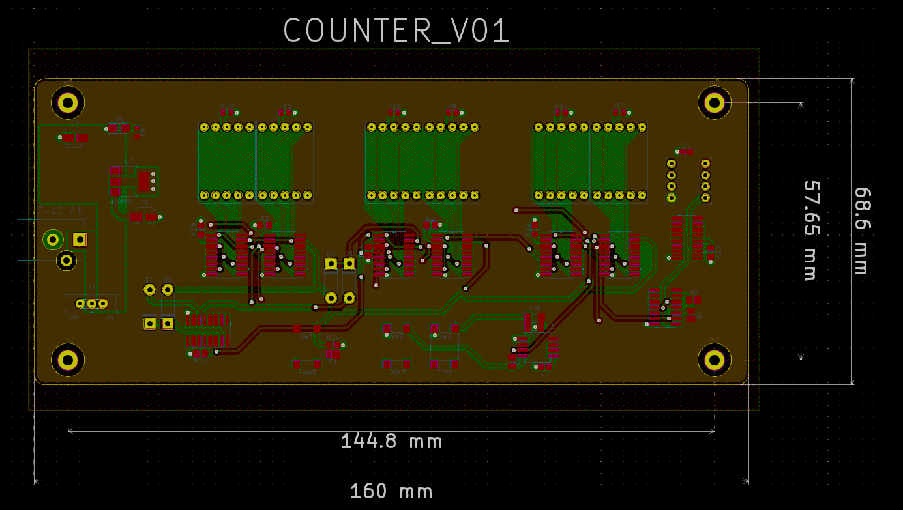

# COUNTER_V01

### Summary: ###
  This board is a seven-segment display stopwatch that can count up to 99 minutes.
  It uses the popular 4XXX series logic chips to drive the displays, as well as a few other popular components
  like the 555 timer to implement other functions.

  The BOM, schematic PDF, and gerber files are all accessible in the _'Outputs/'_ folder. 
  Other project files are not included because they add clutter and can be generated from the project itself in KiCad.
  Thanks.
  
  

